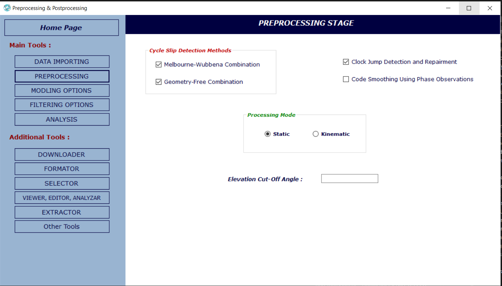
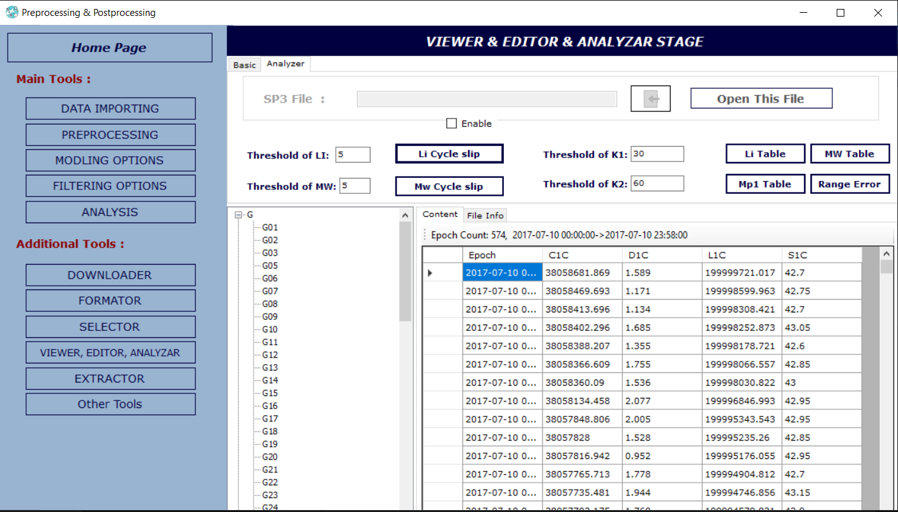

# 🛰️ Case Study: Multi-GNSS Precision Engine (2023)
### Architectural Migration & Advanced Feature Enhancement: MATLAB to C# (.NET)

---

## 📝 Project Context & Innovation
This repository documents a high-level **Technical Case Study** delivered in **2023** for a client's **Master’s Research**. The project was centered on migrating and enhancing a complex GNSS **Precise Point Positioning (PPP)** framework from a MATLAB environment into a robust, standalone **C#** application.

**Key Contributions Beyond Migration:**
* **Premium UI/UX Implementation**: Leveraged **DevExpress** components to build a high-end, responsive, and user-friendly desktop interface for managing complex geodetic data.
* **Feature Enhancement**: Developed custom modules for advanced charting, residual analysis, and trajectory mapping that were not present in the original core.
* **Architectural Re-design**: Re-structured the research logic into a modular C# architecture, improving execution speed and data handling.

---

## 🛠️ The Engineering Pipeline (Preprocessing to Post-processing)

### 1️⃣ Advanced Data Handling & Preprocessing
* **Intelligent Parsers**: Developed high-performance C# logic for RINEX (v2/v3), SP3, CLK, and ATX files.
* **Data Cleaning**: Automated cycle slip detection and outlier removal.

### 2️⃣ Core Geodetic Processing
* **Error Modeling**: Implementation of Saastamoinen (Tropospheric), Ionospheric IF combinations, and Relativistic corrections.
* **Orbital Mechanics**: High-precision satellite coordinate interpolation (Lagrange).

### 3️⃣ Estimation & Filtering
* **Kalman Filter Core**: Re-engineered the estimation engine to solve for 4D state vectors (X, Y, Z, and Clock Bias) with centimeter-level convergence.

### 4️⃣ Post-processing Analysis & Visualization
* **Enhanced Visuals**: Utilized **DevExpress Charting Controls** to visualize satellite residuals, positioning stability, and RMS trends with interactive professional graphs.

---

## 🖼️ Project Gallery

### **A. Main Processing Interface (DevExpress Powered)**
The centralized dashboard utilizing **DevExpress Layout Controls** for seamless management of input files and GNSS constellations.

  

### **B. Advanced Settings & Preprocessing**
Detailed configuration for atmospheric models and frequency combinations using advanced UI components.

  

### **C. Post-processing Visualization**
Interactive charts developed for positioning stability and residual analysis.

  

---

## ⚙️ Technical Stack
* **Languages**: C#, MATLAB (Source).
* **UI Framework**: **DevExpress (WinForms)**.
* **Environment**: .NET Framework.
* **Key Algorithms**: Kalman Filter, Numerical Interpolation, Geodetic Transformations.
* **Timeline**: Developed & Delivered in 2023.

---

## 👤 Project Status & Code Access
> [!IMPORTANT]
> This is a **Technical Case Study**. To protect proprietary academic research and the client's intellectual property, the full source code is maintained in a **private repository**. 

For professional inquiries or technical discussions, please contact:

**Marwa Mahmoud Mohamed** **📧 Email**: [marwa.sw.eng@outlook.com](mailto:marwa.sw.eng@outlook.com)  
**🔗 LinkedIn**: [marwa-mahmoud123](https://www.linkedin.com/in/marwa-mahmoud123)  
**💻 Portfolio**: [marwa-mahmoud-sw-eng.vercel.app](https://marwa-mahmoud-sw-eng.vercel.app/)

---
*Disclaimer: This project is based on the PPPH software framework for academic research purposes.*
